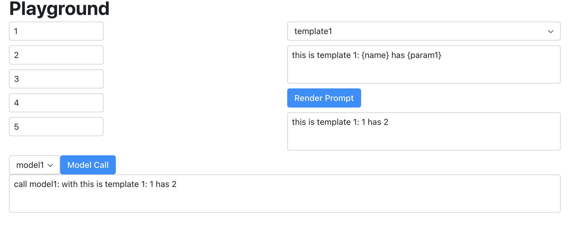

# Python Web Dashboard Comparison

## Summary

This small repository aims to compare four python App/Dashboard libraries, `Gradio`, `Streamlit`, `Taipy`, and `Reflex`. I have create the same demo-dashboard with four different libraries, with minimal work on customized styling by myself. You can check the code and the screenshot to compare them.

## The Demo-Dashboard

The demo-dashboard is a UI for the data interaction, from `/data` directory. The general idea is we have a template with multiple inputs from users, and we want to render the template with user input and send the rendered text to a model for analysis. 

For example, you can imagine an app that needs to send `{GREETING}, {Name}!` to a chatbot and get response back.

**Example 1**

* template: `{GREETING}, {Name}!`
* user input: GREETING=hello, Name=World
* rendered text: `Hello, World!`
* chatbot: `Hello User!`

**Example 2**

* template: `{GREETING}, {Name}!`
* user input: `GREETING=Goodbye, Name=World`
* rendered text: `Goodbye, World!`
* chatbot: `Goodbye User!`

## Comparison

You can chat the code (**/dashboard.py) and the screenshot to make your judgements. My comparison can be found in [COMPARISON.md](COMPARISON.md)


## Progress

| Gradio | Streamlit | Taipy | Reflex |
| :----- | :-------- | :---- | :----- |
| DONE   | DONE      | DONE  | DONE   |


## Run

**gradio**

```shell
make install-gradio
.venv/bin/python gradio_example/dashboard.py
```
then open http://127.0.0.1:7860

**streamlit**

```shell
make install-streamlit
.venv/bin/python -m streamlit run streamlit_example/dashboard.py
# alternatively 
# .venv/bin/streamlit run streamlit_example/dashboard.py
```

then open http://localhost:8501

**taipy**

```shell
make install-taipy
.venv/bin/python taipy_example/dashboard.py --port 8080
```

then open http://localhost:8080


**reflex**

```shell
make install-reflex
cd reflex_example
../.venv/bin/python -m reflex init
../.venv/bin/python -m reflex run
```

then open http://localhost:3000


## Screenshot

Here is an overview of the screenshot.

**Gradio**


**Streamlit**


**Taipy**


**Reflex**

